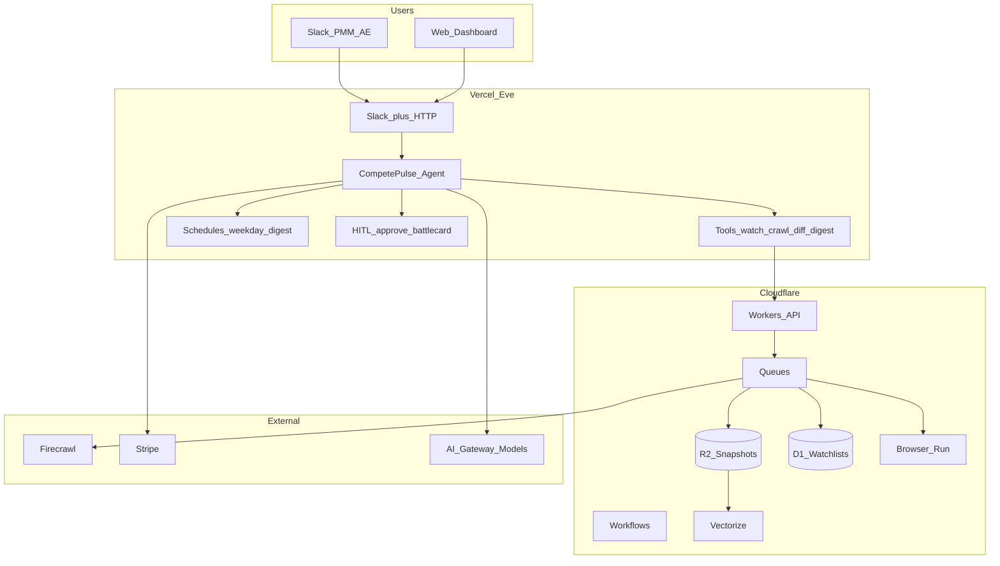
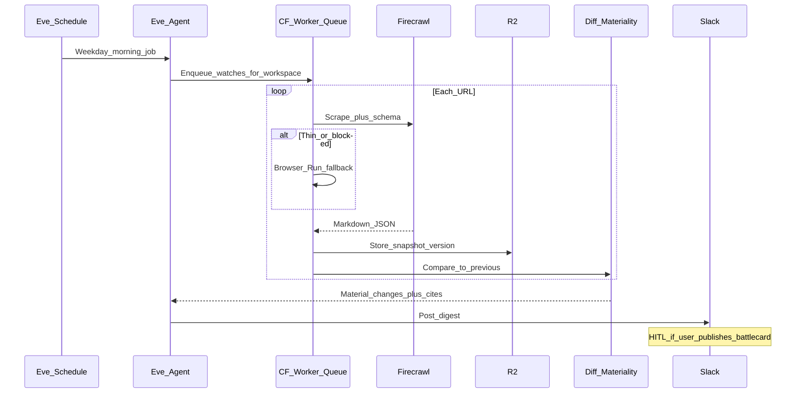

# CompetePulse — Product Requirements Document (PRD)

**Product:** CompetePulse (working name)  
**Tagline:** Slack-native competitive change agent — CI without a CI team  
**Version:** 1.0  
**Last updated:** August 6, 2026  
**Author:** Bharath Kumar  
**Status:** Pre-MVP / Discovery  
**Stack thesis:** [Firecrawl](https://www.firecrawl.dev/) (web context) + [Cloudflare](https://developers.cloudflare.com/) (crawl ops / snapshots) + [Vercel Eve](https://vercel.com/eve) (durable multi-channel agent)

---

## Table of Contents

1. [Executive Summary](#1-executive-summary)
2. [Problem Statement](#2-problem-statement)
3. [Vision & Strategy](#3-vision--strategy)
4. [Target Market & ICP](#4-target-market--icp)
5. [User Personas](#5-user-personas)
6. [Competitive Landscape](#6-competitive-landscape)
7. [Product Principles](#7-product-principles)
8. [Success Metrics](#8-success-metrics)
9. [Phased Roadmap](#9-phased-roadmap)
10. [MVP Definition](#10-mvp-definition)
11. [System Architecture](#11-system-architecture)
12. [Tech Stack](#12-tech-stack)
13. [Data Model](#13-data-model)
14. [Feature Requirements](#14-feature-requirements)
15. [Task Breakdown & Acceptance Criteria](#15-task-breakdown--acceptance-criteria)
16. [Security, Privacy & Compliance](#16-security-privacy--compliance)
17. [Go-to-Market Plan](#17-go-to-market-plan)
18. [Pricing & Business Model](#18-pricing--business-model)
19. [Risks & Mitigations](#19-risks--mitigations)
20. [Team & Operating Model](#20-team--operating-model)
21. [Funding & Milestones (YC-Style)](#21-funding--milestones-yc-style)
22. [Non-Goals](#22-non-goals)
23. [Open Questions](#23-open-questions)
24. [Appendices](#24-appendices)

---

## 1. Executive Summary

### What we're building

CompetePulse is a **Slack-native competitive intelligence agent** for mid-market B2B SaaS. Customers add competitor URLs (pricing, changelog, docs, careers). The system crawls on a schedule, extracts **structured facts** (not raw HTML diffs), stores versioned snapshots, and posts a **morning digest** with citations. Teammates ask follow-ups in Slack; humans **approve** before anything becomes a pinned battlecard.

### Why now

- Enterprise CI (Crayon, Klue) costs **~$15k–$40k+/yr** and needs a dedicated CI owner — mid-market teams are stuck between that and noisy page monitors (~$100/mo).
- [Vercel Eve](https://vercel.com/eve) makes durable, multi-channel agents with HITL and schedules productizable in weeks.
- [Firecrawl](https://www.firecrawl.dev/) turns live sites into LLM-ready markdown/JSON (Search, Scrape, Crawl, Map, Interact, Parse).
- Cloudflare Queues + R2 + Browser Run give **cheap crawl fan-out**, immutable history, and hard-page fallback.
- GTM teams already live in Slack — the product should meet them there, not force another dashboard.

### Wedge (Phase 1)

**One surface, one ICP, one outcome:**

| Dimension | Phase 1 choice |
|-----------|----------------|
| Surface | Slack (primary) + thin web dashboard |
| ICP | B2B SaaS, Series A–C, 20–200 employees, English, Slack-first |
| Outcome | Daily/weekday **material-change digest** with source citations |
| Watch scope | 5 competitors × ~3–5 URLs each (Starter) |
| Human gate | Approve before “publish to #competitive / battlecard” |
| Vertical schema | SaaS pricing + changelog + careers (first extractors) |

### Positioning statement

**For** product marketers and enablement leads at mid-market B2B SaaS **who** cannot justify Klue/Crayon and drown in Visualping noise, **CompetePulse** is a Slack competitive change agent **that** delivers cited, material digests and Q&A **unlike** enterprise CI suites or pixel monitors **because** it sets up in minutes, lives in Slack, and sells an agent coworker — not a battlecard CMS.

### 12-month goal (planning cases)

| Path | Paying workspaces | Ending MRR | ARR run-rate | Assumptions |
|------|-------------------|------------|--------------|-------------|
| Solo / no ads (stress) | ~38 | ~$9k | ~$109k | 10 outbound/day, PH + content |
| Base | ~60–75 | ~$15–20k | ~$190k | PLG + outbound + better conversion |
| YC-pace upside | — | ~$15k+ earlier | — | 5–7% WoW MRR after PMF |

**Decision rule:** Plan personal finances on the stress path; treat base as upside; YC-pace requires all-in focus (not dual-product with RecoverFlow).

### Strategic fork (read this)

CompetePulse and RecoverFlow share agent patterns but **must not run as equal priorities**. YC rule: one problem at a time. If pursuing YC-style growth, choose one company for 90 days.

---

## 2. Problem Statement

### The pain

Mid-market B2B teams need to know when competitors change **pricing, messaging, features, or hiring** — in time to update battlecards, sales talk tracks, and roadmap narratives. Today:

1. Someone occasionally checks competitor sites (inconsistent).
2. Or they buy Visualping/Distill → **noise** (CSS, footer, cookie banners).
3. Or they buy Klue/Crayon → **$15k–$40k+**, months to value, needs a CI owner.
4. Or they paste URLs into ChatGPT → **no memory, no schedule, no audit, no Slack workflow**.

### Why it's a pain killer (for the right ICP)

| Symptom | Business impact |
|---------|-----------------|
| Sales learns about a price cut mid-call | Lost deals / discount panic |
| Feature launch missed for 2–4 weeks | Stale battlecards; enablement lag |
| PMM maintains Notion “CI dump” | High effort, low trust, no citations |
| Alert fatigue from page monitors | Team mutes the channel |

### Current alternatives

| Approach | Failure mode |
|----------|--------------|
| Manual browsing / Notion | Doesn't scale; no history |
| Visualping / Distill | Diff noise; no “so what” |
| Crayon / Klue | Price + implementation for enterprises |
| Kompyte | Closer but not Slack-agent-first |
| DIY scrapers + LLM | Breaks; no durability/evals/HITL |
| Perplexity / ChatGPT | No org memory or scheduled watches |

### Job to be done

> **"Every morning in Slack, tell me what materially changed on our competitors — with links — so I can update the team in five minutes, not spend Friday afternoons doom-scrolling pricing pages."**

---

## 3. Vision & Strategy

### Vision (3 years)

Become the **default competitive coworker** for mid-market B2B GTM — always-on watches, cited answers in Slack/Teams, approved battlecard snippets, and a proprietary change history that compounds into a moat.

### Strategic layers (layer cake)

```
Phase 0: Concierge digests (manual + light tooling) → prove love
    ↓
Phase 1: Slack agent + scheduled crawl + material digest + HITL
    ↓
Phase 2: Q&A over history, battlecard approve flow, annual billing, referrals
    ↓
Phase 3: CRM hooks, Teams, vertical schemas, partner channel
    ↓
Phase 4: Enablement suite / expansion toward full CI (only if NRR + demand pull)
```

### Moat path

1. **Precision:** eval harness for “material change” (false-positive rate is the product).
2. **History:** R2 versioned snapshots → cannot be rebuilt overnight by a chatbot.
3. **Workflow:** Slack HITL + approve-to-publish habits.
4. **Vertical schemas:** SaaS pricing/changelog extractors that beat generic scrape.

---

## 4. Target Market & ICP

### Primary ICP (Phase 1)

| Attribute | Specification |
|-----------|---------------|
| Company type | B2B SaaS (PLG or sales-led) |
| Stage | Series A–C (or bootstrapped with ≥$2M ARR) |
| Employees | 20 – 200 |
| Geography | US, Canada, UK, AU (English); Slack-first |
| Buyer | Head of Product Marketing, Dir. Enablement, Head of Growth |
| User | PMM, Enablement, Founding AE, Product |
| Champion | PMM who already maintains a competitor Notion page |
| Trigger | New PMM hire, Series A/B raise, lost deal to named competitor |

### Negative ICP (do not pursue in Phase 1)

- Enterprises with dedicated CI team and Klue/Crayon already
- Non-Slack companies (Teams = Phase 3)
- Consumer brands needing social listening (Brand24 territory)
- Agencies wanting white-label for 50 clients (Phase 4 / Workers for Platforms)
- Prospects who want “scrape behind login walls” as day-1 requirement

### TAM / SAM / SOM (rough, honest)

| Level | Estimate | Logic |
|-------|----------|-------|
| TAM | ~$3B+ | Competitive intelligence + sales enablement software |
| SAM | ~$400–800M | Mid-market CI / web monitoring + enablement adjacency |
| SOM Y1 | ~$0.1–0.2M ARR | Stress ~$110k → base ~$190k |
| SOM Y3 (focused wedge) | ~$1–4M ARR | Before colliding with full CI suites |

---

## 5. User Personas

### Persona 1: Maya — Product Marketing Manager (Primary user)

| Field | Detail |
|-------|--------|
| Title | PMM / Senior PMM |
| Goals | Fresh battlecards; credible competitive narratives; less manual research |
| Pain | Spends Fri afternoons checking 8 competitor sites; Notion docs go stale |
| Tools | Slack, Notion, Figma, HubSpot/Salesforce lightly |
| Success quote | *"Just ping me when pricing or messaging actually changes — with the link."* |

### Persona 2: Chris — Head of Enablement (Economic buyer / champion)

| Field | Detail |
|-------|--------|
| Title | Dir. Enablement / RevOps-adjacent |
| Goals | Reps win more competitive deals; less “I didn't know they launched X” |
| Pain | Battlecards outdated; no owner for CI budget at $20k |
| Buying trigger | Three competitive losses in a quarter with surprise features |
| Success quote | *"If sales actually reads the digest, I'll pay annually."* |

### Persona 3: Sam — Founding AE (Power user)

| Field | Detail |
|-------|--------|
| Title | AE / Founding AE |
| Goals | Instant answers before calls |
| Pain | Asks PMM in Slack; waits; Googles competitor docs mid-demo |
| Success quote | *"@CompetePulse how does Acme price SSO vs us?"* |

---

## 6. Competitive Landscape

| Competitor | Price band | Strength | Our wedge |
|------------|------------|----------|-----------|
| **Klue** | ~$15–40k+/yr | Battlecards, enablement, CRM | Too expensive; slow; not Slack-agent-first |
| **Crayon** | ~$15–40k+/yr | Broad signal capture | Same — enterprise CI program |
| **Kompyte** | Lower than Klue | Automated monitoring | Less agent coworker / HITL workflow |
| **Visualping** | ~$14–100+/mo | Cheap page change alerts | Noise; no materiality; no Q&A |
| **Distill.io** | Low | Browser extension monitors | DIY; no team agent |
| **DIY ChatGPT** | Tokens | Flexible | No schedule, memory, citations pipeline, HITL |
| **Perplexity Enterprise** | High | Research answers | Not continuous competitor watches |

### Battlecards (sales)

**vs Visualping:** "They tell you *something* changed. We tell you *what mattered* — pricing tiers, features, jobs — with citations, in Slack."

**vs Klue/Crayon:** "They're a CI program for companies with a CI owner. We're an agent for teams that need 80% of the value at 10% of the price."

**vs ChatGPT:** "ChatGPT forgets yesterday. We keep a versioned history and wake up every morning."

---

## 7. Product Principles

1. **Slack is the product** — dashboard is secondary (audit, billing, watchlist).
2. **Silence is a feature** — no material change → short “all quiet” or skip (configurable).
3. **Citations or it didn't happen** — every claim links to snapshot + live URL.
4. **Human approves publish** — digests can auto-post; battlecards never auto-pin without HITL.
5. **Caps protect margin** — hard competitor/URL/crawl limits per plan; overage explicit.
6. **Materiality over completeness** — better to miss a footer tweak than cry wolf.
7. **Evals before growth** — do not scale crawl volume until precision gates pass.
8. **Do things that don't scale first** — Collison-install into customer Slack; concierge early digests.

---

## 8. Success Metrics

### North-star

**Weekly MRR growth rate** (once charging). Pre-revenue: **activated workspaces** (Slack installed + ≥3 URLs + ≥1 digest delivered).

### Product metrics

| Metric | Phase 0 | Phase 1 gate | Phase 2 target |
|--------|---------|--------------|----------------|
| Time-to-first-digest | <24h concierge | <10 min self-serve | <5 min |
| Digest open rate (Slack) | ≥70% | ≥60% | ≥65% |
| Material precision (human label) | ≥80% | ≥85% | ≥90% |
| False-positive rate | ≤25% | ≤15% | ≤10% |
| Follow-up questions / workspace / wk | ≥1 | ≥2 | ≥3 |
| Approve→publish actions / mo | — | ≥2 / Pro workspace | ≥5 |
| Logo churn (monthly) | — | ≤4% | ≤2% (annual mix) |
| Gross margin | — | ≥70% | ≥75% |

### Growth metrics (YC-style)

| Weekly MRR growth | Interpretation |
|-------------------|----------------|
| ~1% | Not figured out |
| 5–7% | YC-good |
| ~10% | Exceptional |

### Funnel metrics (GTM)

| Stage | Solo stress assumption | Target after messaging fit |
|-------|------------------------|----------------------------|
| Outbound touches / mo | 200 | 400 |
| Reply rate | 8% | 12%+ |
| Meeting → paid | 18–25% | ≥30% |
| Trial → paid (PLG) | 8–12% | 15%+ |
| Referral k-factor | ~0.1 | ≥0.4 |

### Unit economics targets

| Line | Target |
|------|--------|
| Blended ARPU | ~$267/mo steady state |
| COGS / workspace | ≤$60 Starter; ≤$120 Pro (with caps) |
| CAC (PLG) | $200–800 |
| CAC payback | ≤4 mo PLG; ≤12 mo sales-assist |
| NRR | ≥100% Y1; ≥110% Y2 |

---

## 9. Phased Roadmap

| Phase | Weeks | Goal | Exit criteria |
|-------|-------|------|---------------|
| **0 Discovery & Concierge** | 1–4 | Prove love | 3 design partners; 10 discovery calls; manual digests loved |
| **1 MVP** | 5–10 | Slack agent live | 5 paying or paid pilots; precision ≥85% on eval set |
| **2 Growth loop** | 11–20 | Compound | Referrals live; annual plans; ~$4k+ MRR |
| **3 Expand** | 21–40 | Scale channel | Teams or CRM hook; partner motion; ~$9–15k MRR |
| **4 Moat** | 41–52 | Defensibility | Vertical schemas; history UX; NRR ≥110% |

Detailed tasks: [PRODUCT_ROADMAP.md](./PRODUCT_ROADMAP.md) and §15 below.

---

## 10. MVP Definition

### One-liner

> Connect Slack → add competitors → get a cited morning digest of material changes; ask follow-ups; approve before publishing battlecards.

### MVP user flow

```
1. PMM installs CompetePulse Slack app
2. Runs /compete watch add <url> (or web onboarding) for 5 competitors
3. Cloudflare queue crawls URLs (Firecrawl scrape + schema extract)
4. Snapshots stored in R2; semantic diff vs previous version
5. Eve schedule posts weekday digest to #competitive (or DM)
6. User asks: "What changed on Acme pricing this month?"
7. User clicks Approve to pin a battlecard snippet (HITL)
8. Web dashboard: watchlist, last changes, billing, sources
```

### MVP scope — IN

- [ ] Slack channel (Eve): install, commands, digest post, thread Q&A
- [ ] Watchlist CRUD (competitors, URLs, labels: pricing|changelog|docs|careers|other)
- [ ] Scheduled crawl (weekday cron)
- [ ] Firecrawl scrape + structured extract for SaaS pricing & changelog
- [ ] R2 snapshot storage + basic text/semantic diff
- [ ] Materiality classifier (LLM + rules) with cite links
- [ ] HITL approve for “publish battlecard snippet”
- [ ] Thin Next.js (or Eve HTTP) dashboard: watchlist + history + Stripe billing
- [ ] Hard caps: Starter 5 competitors / 25 URLs / N crawls/day
- [ ] Eval harness: 20 fixture pages, precision scoring
- [ ] Browser Run fallback tool when scrape is thin/blocked

### MVP scope — OUT

- [ ] Microsoft Teams
- [ ] Salesforce/HubSpot writeback
- [ ] Full battlecard CMS
- [ ] Social listening / news APIs as primary
- [ ] Login-wall scraping as guaranteed support
- [ ] White-label / agencies multi-tenant platform
- [ ] Mobile app
- [ ] Autopublish battlecards without approval

### MVP demo script (3 min)

1. Show Slack `/compete watch add` on a real competitor pricing URL  
2. Trigger crawl → show structured extract (tiers, prices)  
3. Simulate a price change → digest posts with “what changed” + link  
4. Ask a follow-up in thread → cited answer  
5. Approve → snippet lands in #competitive  

---

## 11. System Architecture

### High-level architecture



### Crawl and digest sequence



### Responsibility split (non-negotiable)

| Layer | Owns |
|-------|------|
| **Eve** | Agent loop, Slack UX, schedules, HITL, session durability, model calls |
| **Firecrawl** | Primary scrape/search/extract quality path |
| **Cloudflare** | Job fan-out, retries, R2 history, D1 config, Vectorize, Browser Run fallback |
| **Stripe** | Billing, plan caps metadata |

### Deployment (Phase 1)

| Component | Where |
|-----------|--------|
| Eve agent app | Vercel |
| Dashboard | Same Vercel project or Eve HTTP channel |
| Crawl workers / queues | Cloudflare Workers + Queues |
| Snapshots | Cloudflare R2 |
| Metadata | Cloudflare D1 (or Postgres if Eve world requires — see open questions) |
| Secrets | Vercel + Cloudflare env; never in repo |

---

## 12. Tech Stack

| Layer | Choice | Why |
|-------|--------|-----|
| Agent framework | **Vercel Eve** | Durable sessions, Slack channel, schedules, HITL, tools-as-files |
| Models | Via **AI Gateway** (GPT/Claude mid-tier defaults) | Routing + fallbacks; cost control |
| Web scrape | **Firecrawl** scrape/crawl/map/search | LLM-ready markdown + JSON schemas |
| Hard pages | **Cloudflare Browser Run** | Playwright/CDP fallback; optional live view later |
| Async jobs | **Cloudflare Queues + Workflows** | Retries, fan-out, cron-friendly |
| Object storage | **R2** | Versioned snapshots, low egress |
| Relational / config | **D1** (Phase 1) | Watchlists, workspace, crawl runs |
| Vectors | **Vectorize** (Phase 1.5) | Semantic “did meaning change?” |
| Billing | **Stripe** Checkout + Customer Portal | Self-serve Starter/Pro |
| Auth | Slack workspace install + magic-link dashboard | Minimal friction |
| Observability | Vercel Observability + CF logs | Token/crawl cost dashboards |
| Evals | Fixture repo + scored rubrics in CI | Precision gate |

### Tool files (Eve `agent/tools/` — MVP)

| Tool | Purpose |
|------|---------|
| `watch_add.ts` | Add competitor URL + label |
| `watch_list.ts` | List watches |
| `watch_remove.ts` | Remove watch |
| `crawl_now.ts` | Enqueue immediate crawl |
| `get_changes.ts` | Query material changes in window |
| `draft_battlecard.ts` | Draft snippet from change (requires HITL to publish) |
| `firecrawl_scrape.ts` | Direct scrape helper |
| `browser_fallback.ts` | CF Browser Run when needed |

### Skills (Eve `agent/skills/`)

| Skill | Purpose |
|-------|---------|
| `material_change.md` | When to alert vs stay silent |
| `saas_pricing_schema.md` | How to read pricing pages |
| `digest_voice.md` | Tone: concise, cited, no hype |

---

## 13. Data Model

### Core entities

```text
Workspace
  id, slack_team_id, plan (starter|pro), stripe_customer_id
  competitor_limit, url_limit, crawl_daily_cap
  digest_channel_id, digest_cron, created_at

Competitor
  id, workspace_id, name, domain, notes

Watch
  id, competitor_id, url, label (pricing|changelog|docs|careers|other)
  extract_schema_id, enabled, last_crawl_at, last_success_at

CrawlRun
  id, watch_id, status, started_at, finished_at
  provider (firecrawl|browser), error, cost_cents

Snapshot
  id, watch_id, crawl_run_id, r2_key
  content_hash, extracted_json, created_at

ChangeEvent
  id, watch_id, from_snapshot_id, to_snapshot_id
  materiality (none|low|high), summary, citations_json
  precision_label (null|tp|fp|fn)  -- human/eval

BattlecardDraft
  id, workspace_id, change_event_id, body_md
  status (draft|approved|rejected), approved_by, approved_at

UsageLedger
  id, workspace_id, metric (crawl|llm_tokens|browser_ms)
  quantity, at
```

### Extracted JSON (SaaS pricing schema — v1)

```json
{
  "currency": "USD",
  "plans": [
    { "name": "Pro", "price_monthly": 99, "price_annual": 79, "unit": "seat" }
  ],
  "features_called_out": ["SSO", "Audit logs"],
  "free_trial_days": 14,
  "notes": []
}
```

---

## 14. Feature Requirements

### P0 — Must have (MVP)

| ID | Requirement | Notes |
|----|-------------|-------|
| F1 | Slack OAuth install | Eve Slack channel |
| F2 | Watch add/list/remove | Slash commands + dashboard |
| F3 | Weekday scheduled digest | Eve schedules |
| F4 | Firecrawl scrape + schema extract | Pricing + changelog first |
| F5 | Snapshot to R2 + hash | Immutable history |
| F6 | Materiality summary with citations | LLM + rules |
| F7 | Thread Q&A over recent changes | Agent tools |
| F8 | HITL approve battlecard snippet | Park until approve |
| F9 | Plan caps enforced | Block crawl overage or bill |
| F10 | Stripe Starter/Pro checkout | Self-serve |
| F11 | Eval suite 20 fixtures | CI gate |
| F12 | Browser fallback | Thin scrape path |

### P1 — Should have (Phase 2)

| ID | Requirement |
|----|-------------|
| F13 | Referral invite flow in Slack |
| F14 | Annual billing default |
| F15 | Vectorize semantic diff |
| F16 | Careers / jobs watch schema |
| F17 | Digest preferences (quiet hours, @channel on high only) |
| F18 | Export change CSV |
| F19 | Admin cost dashboard (crawl $ / workspace) |

### P2 — Nice to have (Phase 3+)

| ID | Requirement |
|----|-------------|
| F20 | Microsoft Teams channel |
| F21 | HubSpot/Salesforce note on opportunity |
| F22 | Public teardown blog generator |
| F23 | Partner multi-workspace |
| F24 | Browser Run live view for blocked pages |

---

## 15. Task Breakdown & Acceptance Criteria

### Phase 0 — Discovery & Concierge (Weeks 1–4)

**Goal:** 3 design partners; prove digests are opened and valued before building full automation.

| ID | Task | Acceptance criteria |
|----|------|---------------------|
| P0-1 | ICP outreach list (100 PMM/Enablement) | Spreadsheet with company, LinkedIn, Slack-using signal |
| P0-2 | 10 discovery calls | Notes in Notion; pain scored 1–5; watchlist URLs collected |
| P0-3 | Landing page + Calendly | Live URL; headline matches JTBD; ≥1 booking from outbound |
| P0-4 | Secure 3 design partners | Written yes (email/Slack); NDA optional |
| P0-5 | Concierge digests 2 weeks | ≥10 digests delivered; open rate ≥70%; ≥5 qualitative “useful” quotes |
| P0-6 | Materiality rubric v0 | Doc defining high/low/none with 15 labeled examples |
| P0-7 | Domain + Slack app draft | `competepulse.com` (or chosen) registered; Slack app stub |
| P0-8 | Kill/continue gate | Founder written decision: continue CompetePulse **or** pause for RecoverFlow |

**Phase 0 exit:** ≥3 design partners love concierge; precision rubric exists; go/no-go recorded.

---

### Phase 1 — MVP (Weeks 5–10)

**Goal:** Automated Slack digests for design partners; first paid pilots.

#### Epic E0 — Project setup

| ID | Task | Acceptance criteria |
|----|------|---------------------|
| E0-1 | Monorepo `competepulse/` scaffold | Eve agent + CF worker packages build locally |
| E0-2 | Secrets + env templates | `.env.example`; no secrets in git; `.netlify`/`.vercel` ignored as needed |
| E0-3 | CI lint/test | PR checks run unit tests + eval dry-run |

#### Epic E1 — Eve agent + Slack

| ID | Task | Acceptance criteria |
|----|------|---------------------|
| E1-1 | `instructions.md` identity | Agent refuses unrelated tasks; cites sources |
| E1-2 | Slack channel wired | Install to test workspace; bot posts |
| E1-3 | `/compete watch add\|list\|remove` | Round-trip persists to D1 |
| E1-4 | Weekday schedule | Cron fires; idempotent per workspace/day |
| E1-5 | HITL publish | Approve/reject buttons; session parks/resumes |

#### Epic E2 — Crawl pipeline

| ID | Task | Acceptance criteria |
|----|------|---------------------|
| E2-1 | CF Queue consumer | 100 URL fan-out retries with backoff |
| E2-2 | Firecrawl scrape tool | Returns markdown + JSON for pricing fixture |
| E2-3 | R2 snapshot write | Versions immutable; content_hash stable |
| E2-4 | Diff + materiality | On fixture “price change,” emits high materiality + summary |
| E2-5 | Browser fallback | When scrape `< N` chars, Browser Run path succeeds on known JS page |
| E2-6 | Caps enforcement | 26th URL on Starter rejected with upgrade message |

#### Epic E3 — Digest + Q&A

| ID | Task | Acceptance criteria |
|----|------|---------------------|
| E3-1 | Digest formatter | Slack blocks: competitor, change, cite link, “why it matters” ≤2 lines |
| E3-2 | Quiet mode | Zero high/low changes → “All quiet” single line (configurable) |
| E3-3 | Thread Q&A | Question answers only from snapshots/changes; includes URLs |
| E3-4 | Battlecard draft tool | Creates draft; cannot post to channel without HITL |

#### Epic E4 — Billing + dashboard

| ID | Task | Acceptance criteria |
|----|------|---------------------|
| E4-1 | Stripe products | Starter $149, Pro $399; webhook updates plan |
| E4-2 | Dashboard watchlist | Auth’d user sees competitors/URLs/last crawl |
| E4-3 | History view | Click change → see summary + snapshot link |

#### Epic E5 — Quality

| ID | Task | Acceptance criteria |
|----|------|---------------------|
| E5-1 | Eval set 20 pages | Checked into repo with expected extracts |
| E5-2 | Precision score job | Materiality precision ≥85% on eval before prod crawl scale |
| E5-3 | Cost meter | Per-workspace crawl+LLM $ visible to founder |

**Phase 1 exit:** 5 paying/paid pilots; daily digests automated; eval ≥85%; gross margin estimate ≥70% at cap.

---

### Phase 2 — Growth loop (Weeks 11–20)

| ID | Task | Acceptance criteria |
|----|------|---------------------|
| P2-1 | Referral skill/flow | After 3 digests, bot offers invite; tracking codes work |
| P2-2 | Annual plans | Checkout offers 2 months free; ≥30% of new logos annual by end of phase |
| P2-3 | Vectorize semantic diff | Reduces FP on cosmetic HTML by ≥30% vs Phase 1 baseline |
| P2-4 | Careers schema | Job title/count extract on careers pages |
| P2-5 | Teardown content system | 1 public teardown/week for 8 weeks; ≥1 attributed signup |
| P2-6 | Weekly growth scoreboard | Notion/Sheet with WoW MRR; reviewed Fridays |
| P2-7 | Churn interviews | Every cancel gets 15-min call; themes logged |

**Phase 2 exit:** ≥$4k MRR; k-factor measured; churn ≤4%/mo or annual mix rising.

---

### Phase 3 — Expand (Weeks 21–40)

| ID | Task | Acceptance criteria |
|----|------|---------------------|
| P3-1 | Winning channel doubled | Document which channel hit best WoW; budget/time 2× |
| P3-2 | Teams **or** CRM hook | One shipped end-to-end; ≥5 workspaces using |
| P3-3 | Partner pilot | 1 enablement consultant with rev share; ≥3 referred logos |
| P3-4 | Pro upsell motion | In-product nudge at 80% URL cap; conversion ≥15% of nudged |
| P3-5 | Hire gate | If ≥$12k MRR and margin ≥75%, open part-time GTM req |

**Phase 3 exit:** Stress-path ~$9k MRR or better; clear channel playbook.

---

### Phase 4 — Moat (Weeks 41–52)

| ID | Task | Acceptance criteria |
|----|------|---------------------|
| P4-1 | History UX | “What changed in 90 days” report per competitor |
| P4-2 | Vertical pack: SaaS CI | Packaged schemas + prompts; marketed as such |
| P4-3 | NRR ≥110% | Expansion > churn over trailing 90 days |
| P4-4 | YC/seed narrative | Traction slide: MRR, precision, logos, NRR |

---

## 16. Security, Privacy & Compliance

| Area | Phase 1 approach |
|------|------------------|
| Data collected | Public URLs, extracted public page content, Slack message metadata needed for bot |
| Customer secrets | Slack tokens via Eve/Connect patterns; Stripe IDs; no scraping credentials in MVP |
| Isolation | Workspace_id on all queries; no cross-tenant snapshot access |
| Retention | Snapshots retained while subscribed; 30-day delete on cancel (configurable) |
| Robots / ToS | Respect Firecrawl/robots policies; document acceptable use |
| Abuse | Rate limits; ban lists for illegal scrape targets |
| DPA | Standard DPA for paid customers (Phase 2) |
| SOC 2 | Not required for MVP ICP; revisit at enterprise push |

**Product promise:** We monitor **public web pages** you configure. We do not claim insider non-public data.

---

## 17. Go-to-Market Plan

### Motion

**PLG + founder-led outbound + content.** No paid ads until $12k MRR or clear CAC math.

### Wedge offer

> “We’ll monitor your top 5 competitors for 14 days. If the digest isn’t useful, we leave. If it is, Starter is $149/mo.”

**Collison install:** on every yes, join Slack, add URLs yourself, ship digest next morning.

### Channels (priority order)

| Priority | Channel | Why |
|----------|---------|-----|
| 1 | Trigger outbound (new PMM / just raised) | Higher intent |
| 2 | PMM/enablement communities | Peer density |
| 3 | Weekly competitor teardown content | Compounds SEO/social |
| 4 | Product Hunt + Launch HN | After retention proven |
| 5 | Referral loop in-product | YC-pace requirement |
| 6 | Enablement consultant partners | Phase 3 |

### Outbound math (solo stress)

```text
200 touches/mo → ~16 replies → ~6 meetings → ~1–2 paid logos/mo
```

To approach base case, raise touches to ~400/mo **or** lift meeting→paid ≥30% **or** add organic ≥4 paid/mo.

### Weekly operating ritual (YC mode)

| Day | Action |
|-----|--------|
| Mon | Set WoW MRR target (aim 5–7% once ≥$1k MRR) |
| Daily | Users talked ≥1; or installs/outbound block |
| Fri | Publish hit/miss; pick **one** channel change for next week |

### Messaging pillars

1. CI without a CI team  
2. Material changes, not HTML noise  
3. Cited, in Slack, in minutes  

---

## 18. Pricing & Business Model

### Plans

| Plan | Price | Includes | Caps |
|------|-------|----------|------|
| **Trial** | $0 / 14 days | Full Starter | 5 competitors, 25 URLs, hard crawl cap |
| **Starter** | **$149/mo** | Digest + Q&A + HITL drafts | 5 competitors, 25 URLs |
| **Pro** | **$399/mo** | Higher caps, battlecard approve flow, priority crawl | 25 competitors, 100 URLs |
| **Annual** | 2 months free | Same | Same |

### Blended economics

| Metric | Value |
|--------|-------|
| Steady-state mix | ~55% Starter / ~40% Pro |
| Blended ARPU | ~$267/mo (~$3,200/yr) |
| Gross margin target | 70–85% with caps |
| Overage | Per-crawl or per-URL add-on (Phase 2) |

### Revenue scenarios

| Scenario | Y1 ARR | Y2 ARR | Y3 ARR |
|----------|--------|--------|--------|
| Conservative / solo stress | ~$80–110k | ~$250–380k | ~$575k+ |
| Base | ~$190k | ~$640k | ~$1.4M |
| Optimistic | ~$380k | ~$1.6M | ~$3.8M |

### Month-by-month solo stress (reference)

See planning model: M12 ≈ **38 logos, ~$9.1k MRR, ~$109k ARR** at $240 ARPU. Full table in internal plan / Appendix E.

### Expansion

- Starter → Pro at URL cap  
- Annual prepay  
- Later: CRM pack, Teams pack, extra competitor bundles  

---

## 19. Risks & Mitigations

| Risk | Likelihood | Impact | Mitigation |
|------|------------|--------|------------|
| Dual-product focus (vs RecoverFlow) | High | High | 90-day exclusive bet; P0-8 go/no-go |
| Digest noise → churn | High | High | Materiality rubric + evals; quiet mode; human labels |
| Crawl COGS blow up | High | High | Hard caps; Browser Run only on fallback; cost meter |
| Nice-to-have category | Medium | High | Sell into triggers (losses, new PMM); charge fast |
| Klue “agent” feature creep | Medium | Medium | Win on price, Slack speed, mid-market service |
| Firecrawl dependency | Medium | Medium | Abstract provider interface; Browser Run backup |
| Slack platform risk | Low | High | Keep HTTP API + future Teams |
| Legal / ToS scraping concerns | Medium | Medium | Public pages only; customer-configured URLs; AUP |
| False claims / hallucination | Medium | High | Citations mandatory; refuse uncited answers |
| Slow sales cycles for “CI” | Medium | Medium | 14-day concierge wedge; PLG checkout |
| Solo founder capacity | High | High | Phase caps; no Phase 3 features before $4k MRR |

---

## 20. Team & Operating Model

### Phase 0–1 (minimum)

| Role | Who | Time |
|------|-----|------|
| Founder | Bharath | Product, GTM, concierge, architecture |
| Eng | Bharath | Eve + CF + Firecrawl MVP |
| Design partners | 3 PMMs | Weekly feedback |

### Hire gates

| When | Hire |
|------|------|
| ≥$12k MRR, margin ≥75%, churn trending down | Part-time GTM / SDR |
| ≥$25k MRR | Full-stack or agent eng |
| NRR ≥110% and support load high | Part-time CS |

### Cadence

| Ritual | Frequency |
|--------|-----------|
| Discovery / customer calls | ≥5/week in Phase 0–1 |
| Design partner sync | Weekly |
| Eval regression | Every deploy |
| Cost + MRR review | Weekly (Fri) |
| Roadmap cut | Monthly |

### India / async tips

- Overlap US morning for demos  
- Loom for digest walkthroughs  
- Slack response SLA during US business hours for paid pilots  

---

## 21. Funding & Milestones (YC-Style)

### Bootstrap path (default)

| Month | Milestone | Capital |
|-------|-----------|---------|
| 1–2 | Discovery + concierge love | ~$500 domain/infra |
| 3–4 | MVP digests automated | ~$1–2k APIs |
| 5–6 | Paid pilots, case study | Reinvest revenue |
| 7–12 | ~$9–20k MRR path | Optional pre-seed |

### YC growth targets (only if all-in)

| Stage | Target |
|-------|--------|
| Post-PMF | 5–7% WoW MRR |
| Exceptional | ~10% WoW |
| Demo Day narrative | Clear wedge, precision metric, $X MRR, N logos |

### YC application narrative (draft)

**Problem:** Mid-market B2B teams miss competitor pricing/feature changes because Klue/Crayon are $20k+ and page monitors are noise.

**Solution:** CompetePulse — Slack agent that watches competitor URLs, extracts structured changes, and posts cited digests with human approval for battlecards.

**Why us / why now:** Eve + Firecrawl + Cloudflare make durable Slack agents with real web context shippable; GTM already lives in Slack.

**Traction:** [X] workspaces, [Y] MRR, [Z]% materiality precision, [N] digests sent.

### Pre-seed use of funds (if raising ~$500k)

| Category | % |
|----------|---|
| Engineering | 45% |
| GTM (content + outbound tools + travel) | 30% |
| Infra (Firecrawl/CF/Vercel) | 15% |
| Legal / ops | 10% |

### Investor proof milestones

| Milestone | Signal |
|-----------|--------|
| $10k MRR | Wedge works |
| Precision ≥90% on eval | Quality moat starting |
| k-factor ≥0.4 | Organic growth |
| NRR ≥110% | Expansion |
| <4% monthly logo churn (or annual-heavy) | Retention |

---

## 22. Non-Goals

- ❌ Building a full Klue-style battlecard CMS in Year 1  
- ❌ Social listening / Twitter/Reddit as core  
- ❌ Guaranteed scraping of authenticated / paywalled apps in MVP  
- ❌ Autopublishing competitive claims without HITL  
- ❌ Mobile-native app  
- ❌ Agency white-label platform (Workers for Platforms) before $25k MRR  
- ❌ Running RecoverFlow as equal priority during CompetePulse YC push  
- ❌ Paid ads before unit economics known  

---

## 23. Open Questions

| # | Question | Decide by | Owner |
|---|----------|-----------|-------|
| 1 | Final name: CompetePulse vs alternatives? | Week 2 | Founder |
| 2 | All-in CompetePulse vs RecoverFlow for 90 days? | End of Phase 0 | Founder |
| 3 | D1 vs Postgres as system of record with Eve? | Week 5 | Founder |
| 4 | Digest default: channel post vs DM? | Week 6 (partners) | Founder |
| 5 | Price: stick $149/$399 or start $99 design-partner? | Week 4 | Founder |
| 6 | Self-serve Slack install vs founder-assisted only in MVP? | Week 5 | Founder |
| 7 | US entity timing | First paid invoice | Founder |
| 8 | News/API sources in Phase 2 or never? | Week 12 | Founder |

---

## 24. Appendices

### A. Glossary

| Term | Definition |
|------|------------|
| Watch | A URL monitored for a competitor |
| Snapshot | Versioned stored content + extract at time T |
| Material change | Change that affects pricing, packaging, features, positioning, or hiring signal per rubric |
| Digest | Scheduled Slack summary of material changes |
| Battlecard snippet | Short approved text for enablement use |
| HITL | Human-in-the-loop approval gate |
| Collison install | Founder sets up product on user’s machine/workspace immediately |

### B. Materiality rubric (v0)

| Label | Examples | Digest? |
|-------|----------|---------|
| **High** | Price change, plan renamed/removed, new enterprise feature on pricing page, TOC/security page claim change | Yes, top |
| **Low** | Minor feature bullet wording, blog post, non-core careers spike | Optional / collapsed |
| **None** | CSS, cookie banner, footer, date stamps, author names | Never |

### C. Discovery call script (15–20 min)

1. How do you track competitors today?  
2. Last time a competitor change surprised sales — what happened?  
3. Which 5 URLs would you watch if a bot did it perfectly?  
4. Slack or email for morning brief?  
5. What would make this a “must keep” in 30 days?  
6. Budget: tools under $200/mo vs need procurement?  
7. Ask for design partner: 14-day concierge.

### D. Architecture decision record (ADR-001)

**Decision:** Eve for agent UX; Cloudflare for crawl factory; Firecrawl primary extract; Browser Run fallback.  
**Reject:** Single Next.js cron scrapers (no durability/HITL); pure Browser Run for all pages (COGS); dashboard-only CI (fails wedge).

### E. Solo stress MRR table (Year 1)

| Month | End customers | ARPU | MRR |
|-------|---------------|------|-----|
| 1–2 | 0 | — | $0 |
| 3 | 3 | $160 | $480 |
| 4 | 8 | $160 | $1,280 |
| 5 | 11 | $160 | $1,760 |
| 6 | 14 | $200 | $2,800 |
| 7 | 17 | $200 | $3,400 |
| 8 | 20 | $200 | $4,000 |
| 9 | 24 | $200 | $4,800 |
| 10 | 28 | $240 | $6,720 |
| 11 | 33 | $240 | $7,920 |
| 12 | 38 | $240 | $9,120 |

### F. Eval fixture policy

- 20 URLs across pricing/changelog/careers  
- Golden extracted JSON committed  
- On each PR: scrape→extract→diff score  
- Block release if precision &lt; 85% on materiality labels  

### G. Related documents

- [PRODUCT_ROADMAP.md](./PRODUCT_ROADMAP.md) — execution checklist  
- Stack opportunity plan (Cursor plan: Firecrawl + Cloudflare + Eve)  
- RecoverFlow PRD — **sibling product; do not dual-prioritize**

### H. Success checklist (print this)

- [ ] Phase 0 go/no-go written  
- [ ] 3 design partners receiving digests  
- [ ] Eval ≥85% before scaling crawls  
- [ ] Caps enforced in code  
- [ ] Stripe live before 10th workspace  
- [ ] Friday WoW metric posted every week after $1k MRR  
- [ ] One channel doubled; others paused  

---

## Document History

| Version | Date | Author | Changes |
|---------|------|--------|---------|
| 1.0 | 2026-08-06 | Bharath | Initial PRD from stack research, revenue stress test, YC growth playbook |

---

*This PRD is a living document. Update after every 5 discovery calls or at phase boundaries. Precision and churn metrics outrank vanity crawl volume.*
